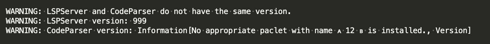

## implicit Token language

x: implicit Times

1: implicit 1

A: implicit All

N: implicit Null

y: implicit Times, implicit 1

B: implicit All, implicit Times

C: implicit All, implicit Times, implicit 1

## Strange Warning

The strange  and  characters are \[LeftSkeleton] and \[RightSkeleton] being rendered with some wrong glyphs.

(The \[LeftSkeleton] and \[RightSkeleton] characters are ocurring because of bad formatting in Failure[] objects)
